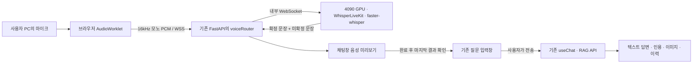

# 한국어 음성 질문 입력 적용 안내

대상 저장소: https://github.com/BaeSeungWoo/Ontology-Driven-RAG-

기준 커밋: `12d16345c228a0bda6258c3170dd48bce726525c`

범위는 **마이크로 질문 → 실시간 인식 미리보기 → 완료 → 질문 확인·수정 → 전송 → 기존 RAG 텍스트 답변**이다. TTS는 포함하지 않는다. 코드는 로컬 저장소에 구현했으며 GitHub push나 운영 서버 배포는 하지 않았다.

## 1. 구현한 구조



마이크는 **웹사이트를 사용하는 PC**에 USB/3.5mm/Bluetooth로 연결한다. 서버에 마이크를 연결하거나 오디오 장치를 Docker에 전달할 필요가 없다. 브라우저에서 마이크 권한을 허용하고 `마이크 선택 → 목록 새로고침`으로 장치를 고른다. 기본값은 운영체제의 기본 마이크다. Chrome/Edge 데스크톱을 우선 대상으로 했다.

브라우저가 네이티브 입력을 16kHz로 변환하고, 100ms씩 모노 signed 16-bit little-endian PCM을 보낸다. 지원하지 않는 브라우저에서는 설명을 표시하고 녹음을 정리한다. 버튼은 녹음 중 음량·미리보기·완료·취소 상태를 표시한다. 무음 감지는 인식 처리에 사용하며, 무음만으로 질문을 자동 전송하지 않는다.

기본 인식 설정은 한국어, `large-v3-turbo`, CUDA/FP16, LocalAgreement, VAD이다. 정확도를 비교하려면 `STT_MODEL=large-v3`로 바꿀 수 있다. 4090에서 실제 지연 시간과 설비 용어 정확도를 측정한 뒤 선택한다. 동일 GPU에서 기존 Ollama도 실행 중이라면 두 모델의 합산 VRAM 사용량을 확인한다.

## 2. 코드 적용

전체 소스 ZIP을 새 폴더에 풀거나, 기준 커밋의 기존 작업 사본에 제공한 패치를 적용한다. 운영 환경 파일을 소스 ZIP으로 덮어쓰지 않는다. ZIP에는 `.env.back`, DB, 모델 가중치, `node_modules`가 없다.

기존 변경사항을 먼저 보존한 후 저장소 루트에서 실행한다.

```bash
git apply --check /path/to/voice-integration.patch
git apply /path/to/voice-integration.patch
```

다른 커밋이나 별도 수정본에서 `--check`가 실패하면 해당 차이를 검토해 병합한다. ZIP에 있는 `VOICE_INPUT.md`와 아래 파일을 기준으로 통합할 수 있다.

| 파일 | 역할 |
|---|---|
| `frontend/src/services/voiceInput.ts` | 마이크 연결, PCM 전송, 최종 결과 확정, 자원 정리 |
| `frontend/public/voice/pcm-worklet.js` | 오디오를 16-bit PCM으로 변환, 마지막 짧은 프레임 보존 |
| `frontend/src/components/chat/question/voiceInput.tsx` | 음성 버튼, 장치 선택, 미리보기, 완료·취소 |
| `frontend/src/components/chat/question/question.tsx` | 확정 음성을 기존 입력에 추가하고 기존 전송 함수 호출 |
| `frontend/src/components/chat/chat.tsx` | 이력/새 대화 전환 시 녹음 취소, 전송 중 중복 동작 방지 |
| `frontend/src/hooks/useChat.ts` | RAG 실패를 전송 실패로 반환해 입력 내용을 보존 |
| `frontend/src/services/api.ts`, `frontend/next.config.ts` | HTTPS에서 동일 출처 API 사용, 로컬 개발 프록시 |
| `backend/app/routers/voiceRouter.py` | 일회용 연결 티켓, 접근 확인, 내부 STT 중계, 시간·용량 제한 |
| `backend/app/main.py` | 기존 FastAPI 앱에 음성 라우터 등록 |
| `services/stt/` | GPU 인식 서버, Dockerfile, 패키지 해시 잠금 파일 |
| `deploy/voice/` | GPU 컨테이너와 HTTPS 프록시 설정 예시 |

기존 질문자, 프롬프트, 모델, RAG 모드, 페르소나를 그대로 전송한다. DB 스키마나 기존 `/api/chat/{llmModel}` 계약은 변경하지 않는다. 인용 메타데이터와 이미지/표 처리는 기존 코드를 사용한다.

## 3. GPU 인식 서버 먼저 실행

준비: NVIDIA 드라이버, NVIDIA GPU를 사용할 수 있는 Docker 환경, 모델 다운로드용 인터넷. Linux에서는 NVIDIA Container Toolkit, Windows에서는 GPU를 지원하는 Docker Desktop/WSL2 환경이 필요하다. 이 패키지의 STT 이미지는 **Linux x86_64 / Python 3.12**용이다.

저장소 루트에서:

```bash
docker compose -f deploy/voice/compose.yaml up -d --build stt
docker compose -f deploy/voice/compose.yaml logs --tail=50 stt
curl http://127.0.0.1:8090/health
```

처음 실행할 때 모델을 받으므로 준비에 시간이 걸린다. `/health`에 `ready: true`, `device: cuda`, `compute_type: float16`, `language: ko`가 나타나야 한다. CUDA/FP16이 아니면 조용히 CPU로 전환하지 않고 시작에 실패한다. 모델 캐시는 Docker 볼륨에 보존한다.

패키지: WhisperLiveKit 0.2.26, faster-whisper 1.2.1, CTranslate2 4.8.2, PyTorch/Torchaudio 2.8.0. `requirements.lock`은 전체 의존성 버전과 해시를 고정한다. 모델 리비전도 서버 코드에서 고정했다. WhisperLiveKit 0.2.26은 기본 정밀도를 자동 선택하므로, 수정된 서버는 로딩 전에 CUDA/FP16을 명시하는 시작 어댑터를 적용한다. 이 변경은 사용자가 보고한 cuda/int8_float16 시작 검사 실패를 수정한다.

| 설정 | 기본값 |
|---|---|
| STT 모델 | `turbo` |
| GPU 동시 인식 | 1명 |
| 질문 녹음 제한 | 180초; 브라우저가 종료 여유 2초를 두고 자동 완료 |
| 미접속 티켓 만료 | 30초 |
| 마지막 음성 처리 대기 | 서버 60초 / 브라우저 65초 |
| 녹음 원본 저장 | 이 기능은 오디오 파일을 저장하지 않음 |

## 4. 기존 FastAPI 백엔드 연결

기존 백엔드 환경을 유지한다. 음성 중계에는 이미 백엔드 의존성에 있는 FastAPI와 websockets를 사용하며, RAG 프로세스에 CUDA/STT 모델을 추가로 설치하지 않는다.

`backend/voice.env.example`의 항목을 **기존 `backend/app/.env.back`에 추가**하거나 백엔드 프로세스 환경에 설정한다. 운영 예시:

```dotenv
VOICE_ENABLED=true
VOICE_ALLOWED_ORIGINS=https://voice.example.com
VOICE_STT_URL=ws://127.0.0.1:8090/asr
VOICE_GATEWAY_KEY=<새로 생성한 32자 이상의 비밀값>
VOICE_MAX_SESSIONS=1
VOICE_MAX_SECONDS=180
```

`voice.example.com`은 실제 도메인으로 바꾸며, Origin에는 경로·마지막 슬래시를 넣지 않는다. STT와 백엔드가 다른 호스트라면 `VOICE_STT_URL`을 내부망 주소로 바꾸고 STT 접근을 백엔드로 제한한다. 기본 Compose는 같은 호스트를 가정한다.

백엔드는 **프로세스/worker 1개**로 실행해야 한다. 티켓과 접속 수가 프로세스 메모리에 있으므로 다중 worker나 여러 인스턴스에서는 티켓을 찾지 못하거나 접속 제한이 나뉜다. 확장 시 Redis 등의 원자적 티켓/접속 관리와 GPU별 라우팅이 먼저 필요하다.

기존 실행 방법을 유지해 재시작한다. 저장소의 기본 실행 진입점은 다음과 같다.

```bash
cd backend
python -m app.main
```

기존 DB·장비 코드·RAG 환경 설정이 있어야 채팅 서버가 시작된다. STT만 추가한다고 기존 RAG 설정이 자동 생성되지는 않는다.

## 5. 프런트엔드 빌드

`frontend/.env.example`을 참고해 실제 빌드 환경의 `NEXT_PUBLIC_API_URL`을 **빈 값**으로 설정한다. 기존 `http://183.104.61.81:...` 값이 남으면 HTTPS 화면에서 혼합 콘텐츠 오류가 발생한다. 해당 값은 빌드 시 포함되므로 변경 후 다시 빌드한다.

```dotenv
NEXT_PUBLIC_API_URL=
API_PROXY_TARGET=http://127.0.0.1:8000
```

```bash
cd frontend
npm ci
npm run test:voice
npm run build
npm run start
```

프런트엔드는 기본 3000번, 기존 백엔드 진입점은 8000번이다. 실제 서비스가 다른 포트를 사용한다면 프록시 설정을 맞춘다. `API_PROXY_TARGET`은 Next 로컬 개발 프록시용이며, 아래 운영 Caddy는 백엔드에 직접 중계한다.

로컬 개발만 먼저 할 때는 백엔드의 `VOICE_ALLOWED_ORIGINS=http://localhost:3000,http://127.0.0.1:3000`, `VOICE_GATEWAY_KEY=`로 설정할 수 있다. 키 없는 접속은 허용 Origin이 모두 localhost인 설정에서만 작동한다. 원격 사용자 접속에는 다음 HTTPS 구성이 필요하다.

## 6. 운영 HTTPS 연결

현재 공개 주소 `http://183.104.61.81:3000/chat`은 브라우저 마이크를 사용할 수 있는 안전한 출처가 아니다. 실제 도메인과 신뢰할 수 있는 TLS 인증서를 연결하고 사용자는 `https://실제도메인/chat`으로 접속해야 한다. 브라우저의 보안 예외 옵션에 의존하지 않는다.

현재 저장소에는 사용자 로그인 대신 장비/IP 판별 로직이 있다. 제공한 HTTPS 예시는 브라우저의 기본 인증으로 접속을 제한하고, 인증을 통과한 음성 요청에만 Caddy가 비밀 헤더를 넣는다. 질문자 입력값을 인증 수단으로 사용하지 않는다. 이미 조직의 로그인 프록시가 있다면 이 인증 부분을 기존 정책에 통합할 수 있다.

1. 도메인의 DNS를 서버로 연결하고 인증서 발급/서비스를 위한 80·443 포트를 준비한다.
2. `deploy/voice/.env.example`을 `.env`로 복사해 도메인과 실제 프런트/백엔드 포트를 적는다.
3. Caddy의 `caddy hash-password`로 비밀번호 해시를 생성해 `VOICE_BASIC_HASH`에 넣는다. `.env`에서는 해시의 `$`가 해석되지 않도록 **작은따옴표로 감싼다**. 평문 비밀번호를 설정 파일에 넣지 않는다.
4. 아래 명령으로 새 중계 키를 생성해 `VOICE_GATEWAY_KEY`에 넣는다. 백엔드 환경에도 **같은 값**을 넣는다. 브라우저 코드나 `NEXT_PUBLIC_*`에 키를 넣지 않는다.

```bash
python -c "import secrets; print(secrets.token_urlsafe(48))"
```

Linux의 Docker 배포 예시:

```bash
docker run --rm -it caddy:2.10.2 caddy hash-password
docker compose --env-file deploy/voice/.env -f deploy/voice/compose.yaml --profile https-linux up -d caddy
```

이 Caddy 컨테이너는 Linux host network를 사용해 기존 호스트의 3000/8000 포트에 접근한다. 기존 root `docker-compose.yml` 대신 이번 `deploy/voice/compose.yaml`을 사용한다. RAG/DB를 다시 컨테이너화하는 작업은 포함하지 않았다.

Windows에서 기존 RAG 서버를 실행 중이면 STT는 위 Docker 서비스로 실행하고, Caddy는 Windows용 바이너리로 실행할 수 있다. `.env`의 `VOICE_DOMAIN`, `VOICE_FRONTEND`, `VOICE_BACKEND`, `VOICE_BASIC_USER`, `VOICE_BASIC_HASH`, `VOICE_GATEWAY_KEY` 값을 Caddy 프로세스 환경 변수에 설정한 뒤 다음을 실행한다. Caddy 네이티브 실행은 `.env`를 자동으로 읽지 않는다.

```powershell
caddy validate --config deploy/voice/Caddyfile --adapter caddyfile
caddy run --config deploy/voice/Caddyfile --adapter caddyfile
```

운영에서는 백엔드·프런트엔드 원래 포트의 외부 직접 접근을 방화벽/바인딩으로 제한하고 HTTPS 프록시로 접속한다. STT 8090 포트는 기본적으로 loopback에만 공개된다. 기존 IP별 장비 판별은 Caddy가 전달하는 요청자 IP를 사용하므로 실제 접속망에서 장비/이력 권한을 확인한다.

## 7. 사용·검수 순서

1. HTTPS 채팅 페이지 접속 → 인증 → 질문자와 기존 서비스 설정 선택.
2. 마이크 연결 → `음성 입력` → 권한 허용. 필요한 경우 `마이크 선택`에서 장치 변경.
3. “M08 장비에서 공구가 등록되지 않았다는 오류가 발생합니다”처럼 말하고 실시간 미리보기를 확인.
4. `완료` → 마지막 처리 종료 후 질문창에 들어온 텍스트 확인. 설비 코드·숫자·영문 오류명은 필요하면 수정.
5. `전송` → 기존 답변 스트리밍, 인용, 이미지/표, 질문 이력이 정상인지 확인.
6. 녹음 중 `취소`, 권한 거부, 마이크 분리, 네트워크 단절, 새 대화/이력/서비스 설정 전환을 확인.
7. 2명이 동시에 시작할 때 두 번째 사용자는 사용 중 안내를 받고, 첫 번째가 종료한 뒤 다시 시작할 수 있는지 확인.
8. 실제 작업장 소음에서 한국어/설비 용어 테스트 문장을 정해 인식 오류율, 첫 자막 지연, 완료 후 확정 지연과 GPU 메모리를 측정.

취소·인식 오류는 원래 입력 내용을 유지한다. 서비스 설정을 바꾸면 녹음만 취소하고 작성 중 텍스트는 유지한다. 새 대화/다른 이력으로 전환하면 입력창도 해당 대화에 맞춰 초기화한다. 음성 중에는 질문 전송을 막고, 질문 생성 요청 중에는 반복 클릭·Enter 전송을 막는다. 이는 같은 화면에서의 동시 중복 방지이며, 네트워크 오류 뒤 수동 재시도나 새로고침에 대한 DB 전체의 exactly-once 보장은 아니다.

## 8. 자동 검증과 남은 운영 확인

구현 검증: 프런트엔드 테스트 20개, 서버 테스트 35개, TypeScript 검사, 새 음성 코드 ESLint, Next 배포 빌드. 로컬 실제 채팅 화면에서 마이크 버튼/장치 메뉴와 기존 3열 배치를 확인했다. RAG 통합 테스트는 실제 `useChat`·`chatApi`를 사용하고 외부 HTTP/DB 응답은 테스트 데이터로 대체한다. STT 서버 테스트 역시 가짜 인식 결과를 사용한다. 최종 PCM 변환 테스트는 NumPy가 설치되어 있어야 실행되며 없으면 해당 테스트만 건너뛴다.

### 최종 문장 재확정 (full_audio_v1)

사용자 GPU 로그에서 전체 파일 인식은 정상이었지만 짧은 실시간 입력의 반복 문장이 LocalAgreement로 먼저 확정되어 마지막까지 남았다. 이에 STT 기본값은 VAC를 끄고 모델 내부 VAD를 유지하며, EOF 후 스트리밍 처리를 마친 다음 세션의 원본 PCM 전체를 같은 모델로 한 번 더 인식한다. 전체 파일 진단과 같은 한국어·beam 5·단어 타임스탬프·VAD 설정을 사용하고 실시간 확정 문장을 프롬프트로 전달하지 않는다.

서버는 새 최종 문장을 `type=final`인 전체 `lines` 스냅샷으로 교체한 뒤 `ready_to_stop`을 보낸다. 기존 브라우저 및 마이크 클라이언트는 스냅샷을 교체하므로 수정 없이 최종 문장을 받는다. 중간 자막에 반복이 보일 수 있으며 최종 재인식이 모든 음성의 정확도를 보장하는 것은 아니다. 녹음 종료 후 전체 재인식 시간이 추가된다. 이 변경의 실제 GPU 최종 문장과 대기 시간은 아직 재검증 전이다.

원본 음성은 최종 인식에 필요한 동안 메모리에만 유지하고 파일로 저장하지 않는다. 기존 600초 한도에서 원본 PCM은 최대 약 19.2MB이고, 최종 변환/모델 처리에는 추가 메모리가 사용된다. 최종 인식 실패·빈 결과·종료 대기 시간 초과는 오류로 처리하며, 잘못된 중간 문장을 성공 결과로 대체하지 않는다. 연결 종료나 시간 초과 후에도 진행 중인 GPU 작업이 끝날 때까지 해당 접속 슬롯을 유지한다. `/health`에서 `vac=false`, `finalization=full_audio_v1`로 적용 여부를 확인한다.

서버 테스트 재현:

```bash
python -m venv .venv-voice-test
# 운영체제에 맞춰 이 가상환경을 활성화한 뒤:
python -m pip install -r tests/voice-test-requirements.txt
python -m pytest tests/test_voice_gateway.py tests/test_voice_stt.py tests/test_voice_precision.py -q
```

이 작업 환경에는 NVIDIA GPU와 Docker 실행 환경이 없어 **실제 음성 모델 추론, 컨테이너 기동, 운영 TLS 발급, 운영 DB/RAG 접속은 검증하지 않았다**. 실제 4090 성능이나 동시 사용자 처리량을 보장하는 수치는 제시하지 않는다. 기존 전체 백엔드 의존성 설치와 전체 RAG 회귀 테스트도 수행하지 않았다.

중단/복구: `VOICE_ENABLED=false` 후 백엔드를 재시작하면 음성 접속을 끌 수 있다. 기존 텍스트 질문은 계속 사용 가능하다. 코드 전체를 되돌리려면 적용 전 보존한 버전으로 복구한다. 프록시를 제거하는 경우 `NEXT_PUBLIC_API_URL`도 이전 배포 방식에 맞춰 다시 빌드한다.

## 참고 문서

- [faster-whisper 공식 저장소](https://github.com/SYSTRAN/faster-whisper)
- [WhisperLiveKit 공식 저장소](https://github.com/QuentinFuxa/WhisperLiveKit)
- [브라우저 getUserMedia와 안전한 출처](https://developer.mozilla.org/en-US/docs/Web/API/MediaDevices/getUserMedia)
- [Caddy 기본 인증](https://caddyserver.com/docs/caddyfile/directives/basic_auth)
- [Caddy WebSocket/스트리밍 역방향 프록시](https://caddyserver.com/docs/caddyfile/directives/reverse_proxy)
- [Docker Compose GPU 연결](https://docs.docker.com/compose/how-tos/gpu-support/)
